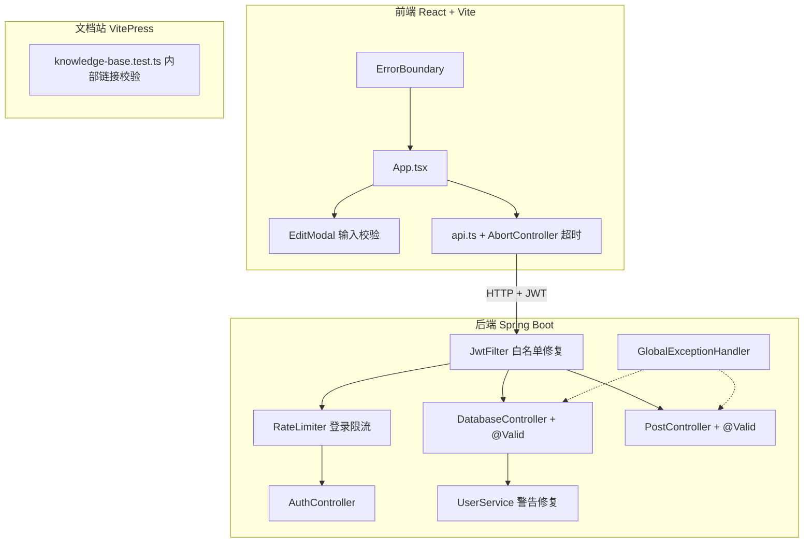

# 设计文档：全栈项目加固

## 概述

本设计文档描述对现有三个项目（React 前端 `fetch-mcp-demo/`、Spring Boot 后端 `java-backend/`、VitePress 文档站 `docs/`）进行安全加固和健壮性优化的技术方案。

改动范围涵盖 8 个独立需求，按优先级分为三类：

1. **安全修复**（需求 1、4、5）：JWT 白名单收紧、后端 Bean Validation、登录限流
2. **前端健壮性**（需求 2、3、6）：ErrorBoundary、输入校验、API 超时
3. **代码质量**（需求 7、8）：编译器警告修复、文档测试增强

每个需求的改动范围小且独立，不涉及架构变更，适合逐个实施。

## 架构

现有架构不变，本次加固在各层增加防御性逻辑：



关键设计决策：

- **限流用内存 ConcurrentHashMap**：项目是学习/演示项目，单实例部署，无需 Redis
- **前端校验 + 后端校验双重防线**：前端校验提升用户体验，后端校验保证数据安全
- **ErrorBoundary 用 class 组件**：React 19 仍然只有 class 组件支持 `componentDidCatch`
- **全局异常处理器统一错误格式**：`@RestControllerAdvice` 捕获校验异常，返回 `ApiResponse` 格式

## 组件与接口

### 需求 1：JwtFilter 白名单修复

**修改文件**：`java-backend/src/main/java/com/example/fetchdemo/filter/JwtFilter.java`

当前问题：
- 白名单包含 `/api/posts/` 和 `/api/users/batch`，且使用 `startsWith` 匹配
- 这导致 `/api/posts/batch`（写操作）和 `/api/users/batch`（写操作）无需认证即可访问

修复方案：
- 白名单缩减为：`/auth/register`、`/auth/login`、`/api/health`
- `isWhitelisted` 方法改为纯 `equals` 精确匹配

```java
private static final List<String> WHITELIST = List.of(
    "/auth/register",
    "/auth/login",
    "/api/health"
);

private boolean isWhitelisted(String path) {
    return WHITELIST.stream().anyMatch(w -> path.equals(w));
}
```

### 需求 2：ErrorBoundary 组件

**新增文件**：`fetch-mcp-demo/src/components/ErrorBoundary.tsx`
**修改文件**：`fetch-mcp-demo/src/App.tsx`

组件接口：
```typescript
interface ErrorBoundaryProps {
  children: React.ReactNode;
}

interface ErrorBoundaryState {
  hasError: boolean;
  error: Error | null;
}
```

- 使用 React class 组件实现 `static getDerivedStateFromError` 和 `componentDidCatch`
- 降级 UI 显示中文错误描述和"重试"按钮
- 重试按钮调用 `setState({ hasError: false, error: null })` 清除错误状态
- 在 `App.tsx` 中包裹 `<Routes>` 组件，确保登录页和主页面均受保护

### 需求 3：EditModal 前端输入校验

**修改文件**：`fetch-mcp-demo/src/components/EditModal.tsx`

新增校验逻辑（纯函数）：

```typescript
interface ValidationErrors {
  [field: string]: string;  // field -> 中文错误信息
}

// 用户表单校验规则
function validateUser(data: Record<string, string | number>): ValidationErrors
// 帖子表单校验规则  
function validatePost(data: Record<string, string | number>): ValidationErrors
```

校验规则：
| 字段 | 规则 |
|------|------|
| name | 1-50 字符 |
| username | 1-30 字符 |
| email | 标准邮箱格式（正则） |
| phone | 最长 30 字符（可选） |
| title | 1-200 字符 |
| body | 1-2000 字符 |

- 校验失败时在字段下方显示红色错误提示
- 存在错误时禁用保存按钮

### 需求 4：后端 Bean Validation

**修改文件**：
- `java-backend/src/main/java/com/example/fetchdemo/entity/User.java`
- `java-backend/src/main/java/com/example/fetchdemo/entity/Post.java`
- `java-backend/src/main/java/com/example/fetchdemo/controller/DatabaseController.java`
- `java-backend/src/main/java/com/example/fetchdemo/controller/PostController.java`

**新增文件**：
- `java-backend/src/main/java/com/example/fetchdemo/common/GlobalExceptionHandler.java`

实体注解：
```java
// User.java
@NotBlank @Size(max = 100) private String name;
@Email private String email;

// Post.java
@NotBlank private String title;
@NotBlank @Size(max = 2000) private String body;
```

Controller 改动：在 `createUser`、`updateUser`、`create`（Post）、`update`（Post）方法的 `@RequestBody` 参数前添加 `@Valid`。

全局异常处理器：
```java
@RestControllerAdvice
public class GlobalExceptionHandler {
    @ExceptionHandler(MethodArgumentNotValidException.class)
    public ResponseEntity<ApiResponse<Map<String, String>>> handleValidation(
            MethodArgumentNotValidException ex) {
        // 提取字段错误，返回 400 + ApiResponse 格式
    }
}
```

注意：`spring-boot-starter-web` 已包含 Hibernate Validator，无需额外依赖。

### 需求 5：登录限流

**修改文件**：`java-backend/src/main/java/com/example/fetchdemo/controller/AuthController.java`

实现方案：在 AuthController 中使用 `ConcurrentHashMap<String, List<Long>>` 记录每个 IP 的请求时间戳。

```java
private final ConcurrentHashMap<String, List<Long>> loginAttempts = new ConcurrentHashMap<>();
private static final int MAX_ATTEMPTS = 10;
private static final long WINDOW_MS = 60_000L; // 1 分钟

private boolean isRateLimited(String ip) {
    // 获取该 IP 的请求时间戳列表
    // 过滤掉窗口外的旧记录
    // 判断窗口内请求数是否 >= MAX_ATTEMPTS
}
```

- 在 `login` 方法开头检查限流，超限返回 HTTP 429
- 通过 `HttpServletRequest.getRemoteAddr()` 获取客户端 IP
- 旧记录在每次检查时惰性清理，无需定时任务

### 需求 6：前端 API 超时

**修改文件**：`fetch-mcp-demo/src/services/api.ts`

修改 `authFetch` 函数，添加 `AbortController` 超时控制：

```typescript
function authFetch(url: string, options: RequestInit = {}): Promise<Response> {
  const controller = new AbortController();
  const timeoutId = setTimeout(() => controller.abort(), 15_000);

  return fetch(url, { ...options, signal: controller.signal, headers })
    .catch(err => {
      if (err.name === 'AbortError') throw new Error('请求超时，请检查网络连接');
      throw err;
    })
    .finally(() => clearTimeout(timeoutId));
}
```

- 超时时间 15 秒
- `finally` 中清理 `setTimeout`，避免内存泄漏
- 如果调用方已传入 `signal`，需要合并处理（当前代码未使用外部 signal，暂不处理）

### 需求 7：UserService 编译器警告修复

**修改文件**：`java-backend/src/main/java/com/example/fetchdemo/service/UserService.java`

三处修复：

1. `extractUserId` 中 `Long.parseLong(s)` → `Long.valueOf(s)`（消除不必要的临时对象警告）
2. `convertFromMap` 中 `instanceof` 链 → `switch` 模式匹配（Java 17+ pattern matching）
3. 添加必要的 null 检查或 `@SuppressWarnings` 消除 null 安全警告

### 需求 8：文档测试增强

**修改文件**：`docs/__tests__/knowledge-base.test.ts`

新增测试用例：扫描所有 `.md` 文件中的内部链接 `[text](/path)` 或 `[text](/path#anchor)`，验证目标文件存在。

```typescript
// 正则匹配内部链接
const internalLinkRegex = /\[([^\]]*)\]\((?!https?:\/\/)([^)]+)\)/g;

// 对每个 .md 文件：
// 1. 提取所有内部链接
// 2. 去掉锚点部分（#section）
// 3. 解析为文件路径（补 .md 后缀或 index.md）
// 4. 验证文件存在
```

- 忽略 `http://` 和 `https://` 开头的外部链接
- 带锚点的链接只验证文件存在，不验证锚点
- 使用 `vitest` 框架（已有依赖）

## 数据模型

### 实体变更

**User 实体**（新增校验注解，字段不变）：
```
User {
  id: Long (PK)
  name: String @NotBlank @Size(max=100)
  username: String
  email: String @Email
  phone: String
  website: String
  city: String
  company: String
  createdAt: LocalDateTime
  updatedAt: LocalDateTime
}
```

**Post 实体**（新增校验注解，字段不变）：
```
Post {
  id: Long (PK)
  userId: Long
  title: String @NotBlank
  body: String @NotBlank @Size(max=2000)
}
```

### 限流数据结构（内存）

```
loginAttempts: ConcurrentHashMap<String, List<Long>>
  key: IP 地址
  value: 请求时间戳列表（毫秒）
```

无数据库变更，无新增表。

### 前端校验错误模型

```typescript
// EditModal 内部状态
interface ValidationErrors {
  [field: string]: string;  // 字段名 -> 中文错误提示
}
// 例如: { name: "姓名长度需在 1-50 个字符之间", email: "邮箱格式不正确" }
```


## 正确性属性

*正确性属性是指在系统所有合法执行中都应成立的特征或行为——本质上是对系统应做什么的形式化陈述。属性是人类可读规格说明与机器可验证正确性保证之间的桥梁。*

### 属性 1：非白名单路径需要 JWT 认证

*对于任意* 不在白名单 `["/auth/register", "/auth/login", "/api/health"]` 中的请求路径，当请求未携带有效 JWT token 时，JwtFilter 应返回 HTTP 401 状态码。

**验证需求：1.1, 1.2, 1.5**

### 属性 2：白名单精确匹配不允许前缀扩展

*对于任意* 白名单路径和任意非空后缀字符串，将后缀拼接到白名单路径后得到的新路径不应被视为白名单路径。

**验证需求：1.4**

### 属性 3：ErrorBoundary 捕获错误并展示降级 UI

*对于任意* 子组件抛出的 JavaScript 运行时错误，ErrorBoundary 应捕获该错误并渲染包含错误描述文本和"重试"按钮的降级 UI。

**验证需求：2.1, 2.2**

### 属性 4：字符串长度校验函数正确性

*对于任意* 字符串和给定的最小/最大长度约束，前端校验函数应在字符串长度在 [min, max] 范围内时返回无错误，在范围外时返回对应的中文错误提示。

**验证需求：3.1, 3.2, 3.4, 3.5, 3.6**

### 属性 5：邮箱格式校验正确性

*对于任意* 符合 `local@domain.tld` 格式的字符串，邮箱校验函数应返回无错误；*对于任意* 不含 `@` 或域名部分不含 `.` 的字符串，应返回错误提示。

**验证需求：3.3**

### 属性 6：存在校验错误时阻止表单提交

*对于任意* 包含至少一个校验错误的表单数据，校验函数返回的错误对象应非空，且保存按钮应处于禁用状态。

**验证需求：3.8**

### 属性 7：Bean Validation 拒绝无效实体字段

*对于任意* name 为空白或超过 100 字符的 User 实体，以及 title 或 body 为空白或 body 超过 2000 字符的 Post 实体，Bean Validation 应产生校验违规。

**验证需求：4.1, 4.2, 4.3, 4.4, 4.7**

### 属性 8：登录限流在阈值内放行、超阈值拒绝

*对于任意* IP 地址，在 1 分钟时间窗口内前 10 次登录请求应被放行，第 11 次及之后的请求应被拒绝（返回 429）。

**验证需求：5.1, 5.2**

### 属性 9：限流时间窗口过期后计数器重置

*对于任意* IP 地址，在时间窗口过期后发起的新请求应被放行，不受之前窗口内请求次数的影响。

**验证需求：5.3**

### 属性 10：API 请求超时抛出包含"请求超时"的错误

*对于任意* 超过 15 秒未响应的 HTTP 请求，authFetch 函数应中止请求并抛出包含"请求超时"描述的 Error 对象。

**验证需求：6.1, 6.3**

### 属性 11：内部链接提取与外部链接过滤

*对于任意* Markdown 内容，链接提取函数应正确提取所有 `[text](/path)` 格式的内部链接，忽略所有 `http://` 或 `https://` 开头的外部链接，并正确去除锚点（`#section`）后解析目标文件路径。

**验证需求：8.1, 8.3, 8.4**

## 错误处理

### 后端错误处理

| 场景 | HTTP 状态码 | 响应格式 |
|------|------------|---------|
| JWT 缺失或无效 | 401 | `{"success":false,"data":null,"message":"缺少认证 token"}` |
| JWT 过期 | 401 | `{"success":false,"data":null,"message":"token 已过期"}` |
| Bean Validation 失败 | 400 | `{"success":false,"data":{"field":"错误信息"},"message":"参数校验失败"}` |
| 登录限流 | 429 | `{"success":false,"data":null,"message":"请求过于频繁，请稍后再试"}` |

- `GlobalExceptionHandler` 统一捕获 `MethodArgumentNotValidException`，提取 `FieldError` 列表，返回字段名到错误信息的 Map
- JwtFilter 中的错误直接写入 `HttpServletResponse`，不经过 Controller 层

### 前端错误处理

| 场景 | 处理方式 |
|------|---------|
| 组件运行时错误 | ErrorBoundary 捕获，展示降级 UI + 重试按钮 |
| 表单校验失败 | 字段下方显示红色错误提示，禁用保存按钮 |
| API 请求超时 | authFetch 抛出 `Error("请求超时，请检查网络连接")`，由调用方 catch 处理 |
| API 返回 401 | 触发 `auth:logout` 事件，跳转登录页（已有逻辑） |

## 测试策略

### 测试框架选择

| 项目 | 单元测试 | 属性测试 |
|------|---------|---------|
| 前端 (React + TS) | Vitest + React Testing Library | [fast-check](https://github.com/dubzzz/fast-check) |
| 后端 (Spring Boot) | JUnit 5 + Mockito | [jqwik](https://jqwik.net/) |
| 文档站 | Vitest | fast-check |

### 双重测试方法

**单元测试**负责：
- 具体示例验证（如：特定路径是否在白名单中）
- 集成点测试（如：Controller + @Valid 的端到端行为）
- 边界条件（如：恰好第 10 次和第 11 次登录请求）
- 错误条件（如：GlobalExceptionHandler 的响应格式）

**属性测试**负责：
- 通用属性验证（如：任意非白名单路径都需要 JWT）
- 输入空间全覆盖（如：任意长度字符串的校验行为）
- 不变量检查（如：限流窗口内请求数 ≤ 10 时放行）

### 属性测试配置

- 每个属性测试最少运行 100 次迭代
- 每个测试用注释标注对应的设计属性
- 标注格式：**Feature: fullstack-hardening, Property {number}: {property_text}**
- 每个正确性属性由一个属性测试实现

### 测试文件规划

| 属性 | 测试文件 | 框架 |
|------|---------|------|
| 属性 1-2 | `java-backend/src/test/.../filter/JwtFilterTest.java` | jqwik |
| 属性 3 | `fetch-mcp-demo/src/__tests__/ErrorBoundary.test.tsx` | fast-check + RTL |
| 属性 4-6 | `fetch-mcp-demo/src/__tests__/validation.test.ts` | fast-check |
| 属性 7 | `java-backend/src/test/.../entity/ValidationTest.java` | jqwik |
| 属性 8-9 | `java-backend/src/test/.../controller/RateLimiterTest.java` | jqwik |
| 属性 10 | `fetch-mcp-demo/src/__tests__/api-timeout.test.ts` | fast-check |
| 属性 11 | `docs/__tests__/link-extraction.test.ts` | fast-check |
