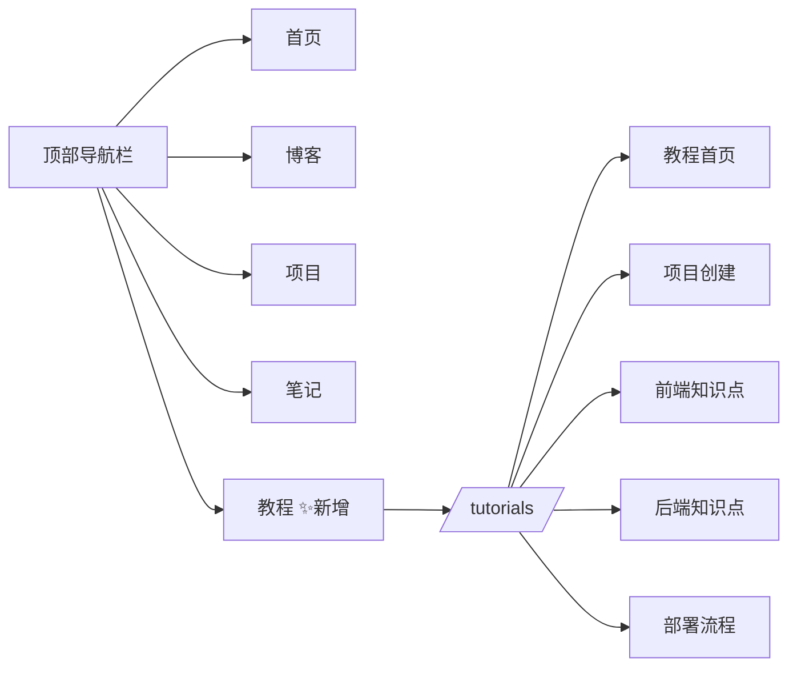

# Design Document: 全栈教程文档系统

## Overview

本设计文档描述在现有 VitePress 文档站（`docs/`）中新增一套完整的全栈项目教程。教程基于真实项目 fetch-mcp-demo，面向零 Java 基础的前端开发者，涵盖前端项目创建、前后端知识点详解、部署流程四大模块。

教程以 Markdown 文件形式存放在 `docs/tutorials/` 目录下，通过修改 `docs/.vitepress/config.mts` 集成到现有站点导航中。所有内容使用中文编写，代码块包含逐行中文注释，Java/Spring Boot 概念均提供 TypeScript/React 类比。

### 设计目标

- 零配置冲突：新增教程页面不影响现有文档站的导航和内容
- 渐进式学习：章节按「项目创建 → 前端知识点 → 后端知识点 → 部署流程」递进排列
- 真实代码驱动：所有代码示例来自项目真实源码，标注文件路径
- 前端视角：用 TypeScript/React 类比解释 Java/Spring Boot 概念

## Architecture

### 文件结构

```
docs/
├── .vitepress/
│   └── config.mts              # 修改：添加教程导航和侧边栏
├── tutorials/
│   ├── index.md                # 教程首页：项目背景、技术栈、章节导航
│   ├── project-setup.md        # 第1章：前端项目创建
│   ├── frontend-knowledge.md   # 第2章：前端知识点详解
│   ├── backend-knowledge.md    # 第3章：后端知识点详解
│   └── deployment.md           # 第4章：部署流程
├── notes/                      # 现有：学习笔记（保持不变）
├── projects/                   # 现有：项目文档（保持不变）
├── blog/                       # 现有：博客（保持不变）
└── index.md                    # 现有：首页（保持不变）
```

### 导航集成方案



VitePress 配置修改点：
1. `nav` 数组新增 `{ text: '教程', link: '/tutorials/' }` 条目
2. `sidebar` 对象新增 `/tutorials/` 键，配置四个章节的侧边栏导航

### 内容引用关系

```mermaid
graph TD
    T[教程页面] -->|链接引用| P[/projects/fetch-mcp-demo]
    T -->|链接引用| N[/notes/java-zero-to-one]
    T -->|代码来源| FE[fetch-mcp-demo/src/]
    T -->|代码来源| BE[java-backend/src/]
    T -->|配置来源| DC[Dockerfile / vercel.json / workflows/]
```

教程与现有文档的关系：
- 教程引用现有文档（通过链接），不重复内容
- 教程直接引用项目真实源码作为代码示例
- 教程首页说明与现有文档的阅读顺序建议

## Components and Interfaces

### 1. VitePress 配置变更（config.mts）

需要修改的配置项：

```typescript
// nav 新增条目
nav: [
  { text: '首页', link: '/' },
  { text: '博客', link: '/blog/' },
  { text: '项目', link: '/projects/' },
  { text: '笔记', link: '/notes/' },
  { text: '教程', link: '/tutorials/' },  // 新增
],

// sidebar 新增教程侧边栏
sidebar: {
  // ... 现有配置保持不变
  '/tutorials/': [
    {
      text: '全栈教程',
      items: [
        { text: '教程首页', link: '/tutorials/' },
        { text: '前端项目创建', link: '/tutorials/project-setup' },
        { text: '前端知识点详解', link: '/tutorials/frontend-knowledge' },
        { text: '后端知识点详解', link: '/tutorials/backend-knowledge' },
        { text: '部署流程', link: '/tutorials/deployment' },
      ],
    },
  ],
}
```

### 2. 教程首页（tutorials/index.md）

内容结构：
- 项目背景介绍（fetch-mcp-demo 是什么）
- 技术栈总览表格（前端/后端/数据库/部署平台）
- 章节目录及每章摘要
- 阅读建议（推荐顺序、前置知识）
- 与现有文档的关系说明和链接

### 3. 前端项目创建教程（tutorials/project-setup.md）

覆盖内容（对应 Requirement 2）：
- Vite 项目初始化（npm create vite@latest）
- vite.config.ts 配置详解（React 插件、React Compiler）
- TypeScript 配置文件体系（tsconfig.json / tsconfig.app.json / tsconfig.node.json）
- 入口文件 main.tsx 解析
- package.json 依赖分析（dependencies vs devDependencies）
- Arco Design 集成（安装、CSS 导入、暗色主题）

代码来源：`fetch-mcp-demo/` 根目录配置文件和 `src/main.tsx`

### 4. 前端知识点教程（tutorials/frontend-knowledge.md）

覆盖内容（对应 Requirement 3）：
- React Hooks（useState / useEffect / useContext）— 来自 `App.tsx`、`AuthContext.tsx`
- TypeScript 类型定义 — 来自 `types/index.ts`
- React Router 路由配置 — 来自 `App.tsx`、`ProtectedRoute.tsx`
- AuthContext 认证上下文 — 来自 `contexts/AuthContext.tsx`
- API 请求封装（authFetch / unwrap） — 来自 `services/api.ts`
- 环境变量使用 — 来自 `.env.local` / `.env.production`

### 5. 后端知识点教程（tutorials/backend-knowledge.md）

覆盖内容（对应 Requirement 4）：
- Spring Boot 三层架构概览（Controller → Service → Repository）
- Entity 实体类 — 来自 `entity/Post.java`、`entity/User.java`、`entity/AppUser.java`
- Repository 数据访问层 — 来自 `repository/` 包
- Service 业务逻辑层 — 来自 `service/` 包
- Controller 控制器层 — 来自 `controller/PostController.java`
- JWT 认证实现 — 来自 `util/`、`filter/`、`controller/AuthController.java`
- ApiResponse 统一响应 — 来自 `common/` 包
- CORS 配置 — 来自 `config/CorsConfig.java`
- Maven pom.xml 解析
- application.properties 配置详解

每段 Java 代码配合 TypeScript 等价代码做对比。

### 6. 部署流程教程（tutorials/deployment.md）

覆盖内容（对应 Requirement 5）：
- TiDB Cloud 数据库配置
- Render 后端部署（Docker Runtime + 环境变量）
- Dockerfile 多阶段构建详解 — 来自 `java-backend/Dockerfile`
- Vercel 前端部署 — 来自 `fetch-mcp-demo/vercel.json`
- GitHub Pages 文档站部署 — 来自 `.github/workflows/deploy-docs.yml`
- GitHub Actions CI/CD — 来自 `.github/workflows/deploy-frontend.yml`
- 部署检查清单
- 常见问题及解决方案

### 代码注释规范（对应 Requirement 6）

所有教程中的代码块遵循统一规范：
- 每行有效代码（非空行、非纯括号行）提供中文注释
- Java 概念使用 TypeScript 类比术语
- 代码块上方提供整体功能说明
- 新概念额外解释含义和用途
- 标注源文件路径（如 `来自 java-backend/src/.../PostController.java`）

## Data Models

本功能不涉及运行时数据模型。核心数据结构是 VitePress 的配置对象和 Markdown 文件内容。

### VitePress 配置数据结构

```typescript
// 导航项
interface NavItem {
  text: string    // 显示文本
  link: string    // 链接路径
}

// 侧边栏组
interface SidebarGroup {
  text: string           // 分组标题
  items: SidebarItem[]   // 子项列表
}

interface SidebarItem {
  text: string    // 显示文本
  link: string    // 链接路径
}

// 侧边栏配置
interface SidebarConfig {
  [path: string]: SidebarGroup[]
}
```

### Markdown 文件结构约定

每个教程 Markdown 文件遵循以下 frontmatter 和内容结构：

```markdown
---
outline: deep
---

# 章节标题

> 章节摘要说明

## 小节标题

说明文字...

<!-- 来自 path/to/source/file.ext -->
```typescript
// 中文注释：说明这行代码的作用
const example = 'code'
`` `

说明文字...
```

### 教程引用的源码文件清单

| 教程章节 | 引用源码文件 |
|---------|------------|
| 项目创建 | `fetch-mcp-demo/vite.config.ts`, `package.json`, `tsconfig.json`, `src/main.tsx` |
| 前端知识点 | `src/App.tsx`, `src/types/index.ts`, `src/contexts/AuthContext.tsx`, `src/services/api.ts`, `src/components/ProtectedRoute.tsx` |
| 后端知识点 | `java-backend/src/main/java/com/example/fetchdemo/` 下所有包 |
| 部署流程 | `java-backend/Dockerfile`, `fetch-mcp-demo/vercel.json`, `.github/workflows/*.yml`, `application-prod.properties` |


## Correctness Properties

*A property is a characteristic or behavior that should hold true across all valid executions of a system — essentially, a formal statement about what the system should do. Properties serve as the bridge between human-readable specifications and machine-verifiable correctness guarantees.*

基于需求分析，本功能的可测试属性主要集中在文件结构完整性和代码注释质量两个维度。大量需求（2.1-2.6, 3.1-3.6, 4.1-4.10, 5.1-5.9 等）属于内容存在性检查，适合用 example-based 测试验证；以下属性适合用 property-based 测试验证。

### Property 1: 教程文件完整性

*For any* 预期的教程文件路径（index.md, project-setup.md, frontend-knowledge.md, backend-knowledge.md, deployment.md），该文件应存在于 `docs/tutorials/` 目录下且内容非空。

**Validates: Requirements 1.1**

### Property 2: 代码块中文注释覆盖

*For any* 教程 Markdown 文件中的代码块，其中每行有效代码（非空行、非纯括号/花括号行）都应包含中文注释（以 `//` 或 `#` 开头的注释行，且包含至少一个中文字符）。

**Validates: Requirements 2.7, 3.7, 5.10, 6.1**

### Property 3: 后端代码块 TypeScript 对比

*For any* 后端知识点教程（backend-knowledge.md）中的 Java 代码块，在其前后上下文中应存在对应的 TypeScript 代码块作为类比对照。

**Validates: Requirements 4.11**

### Property 4: 代码块上下文说明

*For any* 教程 Markdown 文件中的代码块，在代码块的上方（前一个非空文本段落）或下方（后一个非空文本段落）应存在对该代码段功能的整体说明文字。

**Validates: Requirements 6.3**

### Property 5: 代码块来源标注

*For any* 教程 Markdown 文件中引用项目源码的代码块，在其周围上下文中应包含来源文件路径标注（匹配 `来自` 或文件路径模式如 `fetch-mcp-demo/` 或 `java-backend/`）。

**Validates: Requirements 6.5**

## Error Handling

本功能为静态文档内容，不涉及运行时错误处理。需要关注的异常场景：

### VitePress 构建错误

- **死链接**：教程中引用的内部链接路径不存在。现有配置已设置 `ignoreDeadLinks: true`，但应尽量避免死链。
- **Markdown 语法错误**：代码块未正确闭合、frontmatter 格式错误等。VitePress 构建时会报错。
- **配置语法错误**：config.mts 修改后 TypeScript 编译失败。

### 内容一致性风险

- **源码变更**：项目源码更新后教程中的代码示例可能过时。建议在代码块注释中标注引用的文件路径，便于后续维护时定位更新。
- **链接失效**：外部链接（如 TiDB Cloud 文档）可能变更。建议使用 VitePress 的 `ignoreDeadLinks` 配置容忍外部链接失效。

### 缓解措施

- 所有代码块标注来源文件路径，便于追踪源码变更
- 教程引用现有文档而非重复内容，减少维护负担
- VitePress 构建作为 CI 步骤，构建失败会阻止部署

## Testing Strategy

### 测试方法

本功能为静态文档内容，测试策略以验证文档结构和内容质量为主。

#### Unit Tests（Example-Based）

使用 Node.js 脚本或测试框架（如 Vitest）验证具体内容：

1. **导航配置测试**：解析 config.mts，验证 nav 包含「教程」入口，sidebar 包含 `/tutorials/` 配置且章节顺序正确（验证 1.2, 1.3）
2. **教程首页内容测试**：解析 index.md，验证包含项目背景、技术栈、章节链接、阅读建议（验证 1.4）
3. **前端教程内容覆盖测试**：验证 project-setup.md 包含 `npm create vite`, `vite.config.ts`, `tsconfig`, `main.tsx`, `package.json`, `arco-design` 等关键词（验证 2.1-2.6）
4. **前端知识点内容覆盖测试**：验证 frontend-knowledge.md 包含 `useState`, `useEffect`, `useContext`, `interface`, `BrowserRouter`, `AuthContext`, `authFetch`, `import.meta.env` 等关键词（验证 3.1-3.6）
5. **后端知识点内容覆盖测试**：验证 backend-knowledge.md 包含 `Controller`, `Service`, `Repository`, `@Entity`, `JpaRepository`, `@Autowired`, `@RestController`, `JwtUtil`, `ApiResponse`, `CorsConfig`, `pom.xml`, `application.properties` 等关键词（验证 4.1-4.10）
6. **部署教程内容覆盖测试**：验证 deployment.md 包含 `TiDB Cloud`, `Render`, `Dockerfile`, `Vercel`, `vercel.json`, `GitHub Pages`, `GitHub Actions`, 检查清单, 常见问题等关键词（验证 5.1-5.9）
7. **跨文档链接测试**：验证教程文件中包含指向 `/projects/fetch-mcp-demo` 和 `/notes/java-zero-to-one` 的链接（验证 7.1, 7.2）

#### Property-Based Tests

使用 fast-check（JavaScript property-based testing 库）验证文档质量属性：

- 每个 property test 运行至少 100 次迭代
- 每个 test 用注释标注对应的设计属性编号
- 标签格式：**Feature: fullstack-tutorial-docs, Property {number}: {property_text}**

1. **Property 1 测试**：生成预期文件路径列表，验证每个文件存在且非空
2. **Property 2 测试**：解析所有教程 Markdown 文件，提取所有代码块，对每个代码块的每行有效代码验证是否包含中文注释
3. **Property 3 测试**：解析 backend-knowledge.md，提取所有 Java 代码块，验证每个 Java 代码块附近存在 TypeScript 代码块
4. **Property 4 测试**：解析所有教程 Markdown 文件，提取所有代码块，验证每个代码块前后存在说明文字
5. **Property 5 测试**：解析所有教程 Markdown 文件，提取引用项目源码的代码块，验证每个代码块附近包含来源路径标注

#### VitePress 构建验证

- 运行 `npm run build`（在 docs/ 目录下）验证所有 Markdown 文件能正确构建
- 构建成功即验证无语法错误、无严重配置问题

### 测试工具

- **Vitest**：单元测试和 property-based 测试运行器
- **fast-check**：property-based 测试库，生成随机输入验证属性
- **Node.js fs**：读取和解析 Markdown 文件内容
