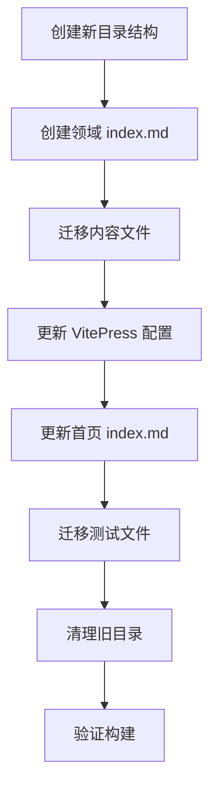

# 设计文档：VitePress 个人知识库重构

## 概述

本设计文档描述如何将 Howyc.dev 从"按输出形式分类"（博客、笔记、项目、教程）重构为"按知识领域分类"的个人知识库。重构范围包括：目录结构调整、文件迁移、VitePress 配置更新、导航系统重建、首页与领域首页更新，以及旧目录清理。

核心设计原则：
- **零内容修改**：仅移动文件位置和更新配置，不修改任何 `.md` 文件的正文内容
- **知识领域优先**：以前端工程师的知识体系为组织维度
- **渐进式迁移**：先创建新结构，再迁移文件，最后清理旧目录

> **注意**：需求文档中未包含 `docs/tutorials/aigc-learning-path.md` 的迁移映射。设计中将其归入 `docs/tools/` 目录下作为独立文件，因为其内容属于 AIGC 工具与学习路径，与 `/tools/` 领域最为匹配。

## 架构

### 整体架构

重构不涉及技术栈变更，仍基于 VitePress 静态站点生成器。架构变更集中在内容组织层面：

```
重构前（按输出形式）          重构后（按知识领域）
docs/                        docs/
├── blog/                    ├── blog/          （保留）
├── notes/                   ├── frontend/      （新建）
├── projects/                │   ├── react/
├── tutorials/               │   ├── typescript/
│                            │   └── engineering/
│                            ├── backend/       （新建）
│                            │   ├── java/
│                            │   └── spring-boot/
│                            ├── devops/        （新建）
│                            │   ├── frontend-deploy/
│                            │   ├── backend-deploy/
│                            │   └── docs-deploy/
│                            ├── tools/         （新建）
│                            │   └── openclaw/
│                            ├── projects/      （保留）
│                            └── blog/          （保留）
```

### 迁移流程



## 组件与接口

### 1. 目录结构组件

负责创建新的知识领域目录树：

```
docs/
├── frontend/
│   ├── index.md
│   ├── react/
│   │   └── frontend-knowledge.md
│   ├── typescript/          （当前无内容，预留）
│   └── engineering/
│       └── project-setup.md
├── backend/
│   ├── index.md
│   ├── java/
│   │   └── java-zero-to-one.md
│   └── spring-boot/
│       ├── java-for-frontend.md
│       └── backend-knowledge.md
├── devops/
│   ├── index.md
│   ├── frontend-deploy/
│   │   └── frontend-deployment.md
│   ├── backend-deploy/
│   │   └── backend-deployment.md
│   └── docs-deploy/
│       └── docs-deployment.md
├── tools/
│   ├── index.md
│   ├── openclaw/
│   │   ├── openclaw-guide.md
│   │   └── openclaw-installation-journey.md
│   └── aigc-learning-path.md
├── projects/
│   ├── index.md             （更新内容）
│   └── fetch-mcp-demo.md   （保留原位）
├── blog/
│   ├── index.md             （更新内容）
│   └── why-java.md          （保留原位）
└── index.md                 （更新首页）
```

### 2. 内容迁移映射表

| 原路径 | 新路径 | 知识领域 |
|--------|--------|----------|
| `notes/java-zero-to-one.md` | `backend/java/java-zero-to-one.md` | 后端 > Java |
| `notes/java-for-frontend.md` | `backend/spring-boot/java-for-frontend.md` | 后端 > Spring Boot |
| `tutorials/project-setup.md` | `frontend/engineering/project-setup.md` | 前端 > 工程化 |
| `tutorials/frontend-knowledge.md` | `frontend/react/frontend-knowledge.md` | 前端 > React |
| `tutorials/frontend-deployment.md` | `devops/frontend-deploy/frontend-deployment.md` | DevOps > 前端部署 |
| `tutorials/backend-knowledge.md` | `backend/spring-boot/backend-knowledge.md` | 后端 > Spring Boot |
| `tutorials/backend-deployment.md` | `devops/backend-deploy/backend-deployment.md` | DevOps > 后端部署 |
| `tutorials/docs-deployment.md` | `devops/docs-deploy/docs-deployment.md` | DevOps > 文档站部署 |
| `tutorials/openclaw-guide.md` | `tools/openclaw/openclaw-guide.md` | 工具 > OpenClaw |
| `tutorials/openclaw-installation-journey.md` | `tools/openclaw/openclaw-installation-journey.md` | 工具 > OpenClaw |
| `tutorials/aigc-learning-path.md` | `tools/aigc-learning-path.md` | 工具 |
| `projects/fetch-mcp-demo.md` | `projects/fetch-mcp-demo.md` | 项目（不移动） |
| `blog/why-java.md` | `blog/why-java.md` | 博客（不移动） |

### 3. VitePress 配置组件（Config_Generator）

`docs/.vitepress/config.mts` 需要更新以下部分：

#### 3.1 导航栏（nav）

```typescript
nav: [
  { text: '首页', link: '/' },
  { text: '前端', link: '/frontend/' },
  { text: '后端', link: '/backend/' },
  { text: 'DevOps', link: '/devops/' },
  { text: '工具', link: '/tools/' },
  { text: '项目', link: '/projects/' },
  { text: '博客', link: '/blog/' },
]
```

#### 3.2 侧边栏（sidebar）

```typescript
sidebar: {
  '/frontend/': [
    {
      text: 'React 开发',
      items: [
        { text: '前端知识点详解', link: '/frontend/react/frontend-knowledge' },
      ],
    },
    {
      text: 'TypeScript',
      items: [],  // 预留，当前无内容
    },
    {
      text: '工程化实践',
      items: [
        { text: '前端项目创建', link: '/frontend/engineering/project-setup' },
      ],
    },
  ],
  '/backend/': [
    {
      text: 'Java 语言',
      items: [
        { text: 'Java 零基础入门', link: '/backend/java/java-zero-to-one' },
      ],
    },
    {
      text: 'Spring Boot 框架',
      items: [
        { text: 'Java 前端视角', link: '/backend/spring-boot/java-for-frontend' },
        { text: '后端知识点详解', link: '/backend/spring-boot/backend-knowledge' },
      ],
    },
  ],
  '/devops/': [
    {
      text: '前端部署',
      items: [
        { text: '前端部署', link: '/devops/frontend-deploy/frontend-deployment' },
      ],
    },
    {
      text: '后端部署',
      items: [
        { text: '后端部署', link: '/devops/backend-deploy/backend-deployment' },
      ],
    },
    {
      text: '文档站部署',
      items: [
        { text: '文档站部署', link: '/devops/docs-deploy/docs-deployment' },
      ],
    },
  ],
  '/tools/': [
    {
      text: 'OpenClaw',
      items: [
        { text: 'OpenClaw 完全指南', link: '/tools/openclaw/openclaw-guide' },
        { text: 'OpenClaw 安装历程', link: '/tools/openclaw/openclaw-installation-journey' },
      ],
    },
    {
      text: 'AIGC',
      items: [
        { text: 'AIGC 学习路线图', link: '/tools/aigc-learning-path' },
      ],
    },
  ],
  '/projects/': [
    {
      text: '项目实战',
      items: [
        { text: '项目总览', link: '/projects/' },
        { text: 'fetch-mcp-demo 详解', link: '/projects/fetch-mcp-demo' },
      ],
    },
  ],
  '/blog/': [
    {
      text: '思考与总结',
      items: [
        { text: '所有文章', link: '/blog/' },
        { text: '为什么学 Java', link: '/blog/why-java' },
      ],
    },
  ],
}
```

#### 3.3 保留的基础配置

以下配置保持不变：
- `lang: 'zh-CN'`
- `base: '/'`
- `search.provider: 'local'`
- `editLink` 配置
- `markdown.lineNumbers: true`
- `ignoreDeadLinks: true`
- `socialLinks`、`footer`、`head`

#### 3.4 更新的配置

- `description`: 更新为 `'前端工程师的个人知识库 — React · Spring Boot · DevOps · 工程实践'`

### 4. 首页组件

`docs/index.md` 更新设计：

```yaml
hero:
  name: "Howyc.dev"
  text: "前端工程师知识库"
  tagline: React · Spring Boot · DevOps · 从前端到全栈的知识体系
  actions:
    - theme: brand
      text: 前端工程
      link: /frontend/
    - theme: alt
      text: 后端开发
      link: /backend/

features:
  - icon: ⚛️
    title: 前端工程
    details: React、TypeScript、工程化实践，现代前端开发全链路
    link: /frontend/
  - icon: ☕
    title: 后端开发
    details: Java 语言基础、Spring Boot 框架，写给前端的后端入门
    link: /backend/
  - icon: 🚀
    title: DevOps
    details: 前端部署、后端部署、文档站部署，全栈部署实践
    link: /devops/
  - icon: 🛠️
    title: 工具与效率
    details: OpenClaw、AIGC 工具，提升开发效率的实用工具
    link: /tools/
  - icon: 💻
    title: 项目实战
    details: 全栈 Demo 项目，从零到部署的完整实践
    link: /projects/
  - icon: ✍️
    title: 思考与总结
    details: 学习过程中的思考、总结和经验分享
    link: /blog/
```

### 5. 领域首页组件（Index_Page）

每个知识领域的 `index.md` 需包含：
- 领域简要介绍
- 子分类列表及其包含的文章链接

示例（`docs/frontend/index.md`）：

```markdown
# 前端工程

前端开发相关的知识和实践，涵盖 React 开发、TypeScript 和工程化实践。

## React 开发

- [前端知识点详解](./react/frontend-knowledge) — React Hooks、路由守卫、认证上下文、API 封装

## TypeScript

> 内容持续更新中...

## 工程化实践

- [前端项目创建](./engineering/project-setup) — Vite 项目创建、配置体系、依赖管理
```

### 6. 测试文件迁移

现有测试文件 `docs/tutorials/__tests__/tutorial-docs.test.ts` 需要更新：
- 迁移到 `docs/__tests__/knowledge-base.test.ts`（项目根测试目录）
- 更新文件路径引用以匹配新目录结构
- 更新配置检查以匹配新的 nav/sidebar 结构
- 保留关键词覆盖测试，但更新文件路径

### 7. 旧路径兼容

由于 `ignoreDeadLinks: true` 已配置，旧路径的内部链接不会导致构建失败。但内容文件中的相对链接（如 `tutorials/index.md` 中引用 `./project-setup`）在文件移动后会失效。

设计决策：由于需求明确"不修改现有内容文件本身"，对于内容文件中的内部链接，采用 VitePress `rewrites` 配置将旧路径映射到新路径：

```typescript
rewrites: {
  // 旧笔记路径 → 新路径
  'backend/java/java-zero-to-one.md': 'notes/java-zero-to-one.md',
  'backend/spring-boot/java-for-frontend.md': 'notes/java-for-frontend.md',
  // 旧教程路径 → 新路径
  'frontend/engineering/project-setup.md': 'tutorials/project-setup.md',
  'frontend/react/frontend-knowledge.md': 'tutorials/frontend-knowledge.md',
  'devops/frontend-deploy/frontend-deployment.md': 'tutorials/frontend-deployment.md',
  'backend/spring-boot/backend-knowledge.md': 'tutorials/backend-knowledge.md',
  'devops/backend-deploy/backend-deployment.md': 'tutorials/backend-deployment.md',
  'devops/docs-deploy/docs-deployment.md': 'tutorials/docs-deployment.md',
  'tools/openclaw/openclaw-guide.md': 'tutorials/openclaw-guide.md',
  'tools/openclaw/openclaw-installation-journey.md': 'tutorials/openclaw-installation-journey.md',
}
```

> **注意**：VitePress 的 `rewrites` 格式是 `{ '源文件路径': '目标URL路径' }`，即将实际文件路径映射为 URL 路径。但由于我们的目标是让旧 URL 仍然可访问，实际上需要反向映射。经过分析，VitePress rewrites 的语义是"将源文件渲染到目标 URL"，因此如果我们希望旧 URL `/tutorials/project-setup` 仍然可用，需要保留旧文件或使用其他方式。
>
> **最终方案**：由于 `ignoreDeadLinks: true` 已启用，且这是个人知识库重构，旧路径的外部链接可以通过搜索引擎自然更新。内容文件中的跨文档链接（如 `/notes/java-zero-to-one`、`/projects/fetch-mcp-demo`）需要在迁移后检查，但由于需求要求不修改内容文件，这些链接将依赖 `ignoreDeadLinks` 配置容忍。

## 数据模型

本项目为纯静态站点，无数据库。数据模型体现为文件系统结构和 VitePress 配置对象。

### 文件系统模型

```
Knowledge_Domain/
├── index.md          # 领域首页（必需）
└── SubCategory/      # 子分类目录
    └── article.md    # 文章文件
```

### VitePress 配置模型

```typescript
interface NavItem {
  text: string    // 显示文本
  link: string    // 链接路径
}

interface SidebarItem {
  text: string              // 分组标题
  items: {
    text: string            // 文章标题
    link: string            // 文章路径
  }[]
}

interface SidebarConfig {
  [path: string]: SidebarItem[]  // 路径 → 侧边栏配置
}
```


## 正确性属性

*属性是一种在系统所有有效执行中都应成立的特征或行为——本质上是关于系统应该做什么的形式化陈述。属性是人类可读规范与机器可验证正确性保证之间的桥梁。*

### 属性 1：目录结构完整性

*对于所有*预期的知识领域目录及其子分类目录，该目录必须存在于文件系统中，且每个一级知识领域目录下必须包含一个 `index.md` 文件。

**验证需求：1.1, 1.2, 1.3, 1.4, 1.5, 1.6, 1.7**

### 属性 2：迁移映射正确性

*对于所有*定义的迁移映射（源路径 → 目标路径），迁移完成后目标路径的文件必须存在，且源路径的文件不再存在（保留原位的文件除外）。

**验证需求：2.1, 2.2, 2.3, 2.4, 2.5, 2.6, 2.7, 2.8, 2.9, 2.10, 2.11, 2.12**

### 属性 3：内容保留不变性

*对于所有*被迁移的内容文件，迁移后的文件内容必须与迁移前完全一致（字节级相同）。

**验证需求：2.13**

### 属性 4：侧边栏配置完整性

*对于所有*知识领域路径，VitePress 的 sidebar 配置中必须存在对应的键，且该键下的分组必须包含该领域所有子分类及其文章链接。

**验证需求：3.2, 3.4, 3.5, 3.6, 3.7, 5.2**

### 属性 5：首页特性卡片覆盖

*对于所有*知识领域，首页的 features 区域必须包含一个对应的概览卡片，且卡片的 link 指向该领域的 Index_Page。

**验证需求：4.2**

### 属性 6：领域首页内容完整性

*对于所有*知识领域的 Index_Page，页面必须包含该领域的简要介绍说明，且必须包含该领域下所有子分类及其文章的链接。

**验证需求：4.4, 4.5**

## 错误处理

### 迁移过程中的错误处理

| 错误场景 | 处理策略 |
|----------|----------|
| 源文件不存在 | 终止迁移，报告缺失文件 |
| 目标目录创建失败 | 终止迁移，报告权限或路径问题 |
| 文件移动失败 | 终止迁移，保留源文件不变 |
| 目标路径已存在同名文件 | 终止迁移，报告冲突 |

### 构建过程中的错误处理

| 错误场景 | 处理策略 |
|----------|----------|
| 侧边栏链接指向不存在的文件 | `ignoreDeadLinks: true` 配置容忍，不阻断构建 |
| 内容文件中的旧路径链接失效 | 同上，依赖 `ignoreDeadLinks` 配置 |
| 配置文件语法错误 | VitePress 构建时报错，需手动修复 |

### 回滚策略

由于使用 Git 版本控制，所有变更可通过 `git revert` 回滚。建议在迁移前创建一个 Git 分支，迁移完成并验证后再合并。

## 测试策略

### 双重测试方法

本项目采用单元测试和属性测试相结合的方式：

- **单元测试**：验证具体示例、边界情况和错误条件
- **属性测试**：验证跨所有输入的通用属性

### 属性测试配置

- **测试框架**：Vitest（已在项目中使用）
- **属性测试库**：fast-check（与 Vitest 集成良好）
- **每个属性测试最少运行 100 次迭代**
- **每个测试用注释标注对应的设计属性**
- **标注格式**：`Feature: knowledge-base-restructure, Property {number}: {property_text}`

### 单元测试覆盖

| 测试类别 | 测试内容 |
|----------|----------|
| 导航栏配置 | 验证 nav 包含所有预期项目（需求 3.1） |
| 导航链接正确性 | 验证 nav 中每个 link 指向对应的 index 页面（需求 3.3） |
| 基础配置保留 | 验证 lang、base、search、editLink 等配置未被修改（需求 5.3） |
| description 更新 | 验证 description 字段已更新（需求 5.4） |
| 首页 actions | 验证首页 actions 按钮链接到核心知识领域（需求 4.3） |
| 首页 tagline | 验证首页 tagline 已更新（需求 4.1） |
| 旧目录清理 | 验证 notes/ 和 tutorials/ 目录已删除（需求 6.1, 6.2） |
| 测试文件迁移 | 验证测试文件已迁移到新位置（需求 6.3） |

### 属性测试覆盖

| 属性 | 测试描述 |
|------|----------|
| 属性 1 | 生成随机知识领域名称，验证目录和 index.md 存在 |
| 属性 2 | 遍历所有迁移映射，验证目标文件存在且源文件已移除 |
| 属性 3 | 对所有迁移文件，比较迁移前后的内容哈希值 |
| 属性 4 | 遍历所有知识领域路径，验证 sidebar 配置包含正确的分组和链接 |
| 属性 5 | 遍历所有知识领域，验证首页 features 包含对应卡片 |
| 属性 6 | 遍历所有知识领域 index.md，验证包含介绍文本和所有文章链接 |

### 测试文件结构

```
docs/__tests__/
└── knowledge-base.test.ts    # 迁移后的综合测试文件
```

每个属性测试必须由单个属性测试实现，标注格式示例：

```typescript
// Feature: knowledge-base-restructure, Property 1: 目录结构完整性
it.prop('所有知识领域目录及子分类目录存在且包含 index.md', [...], (...) => {
  // ...
})
```
