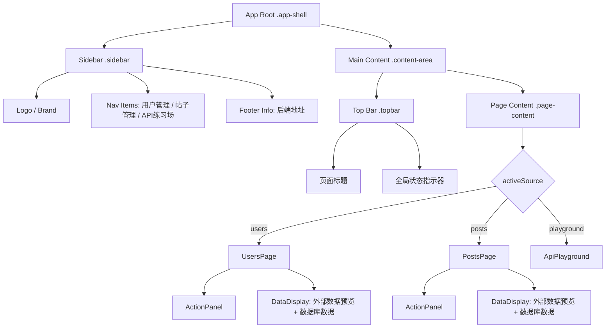
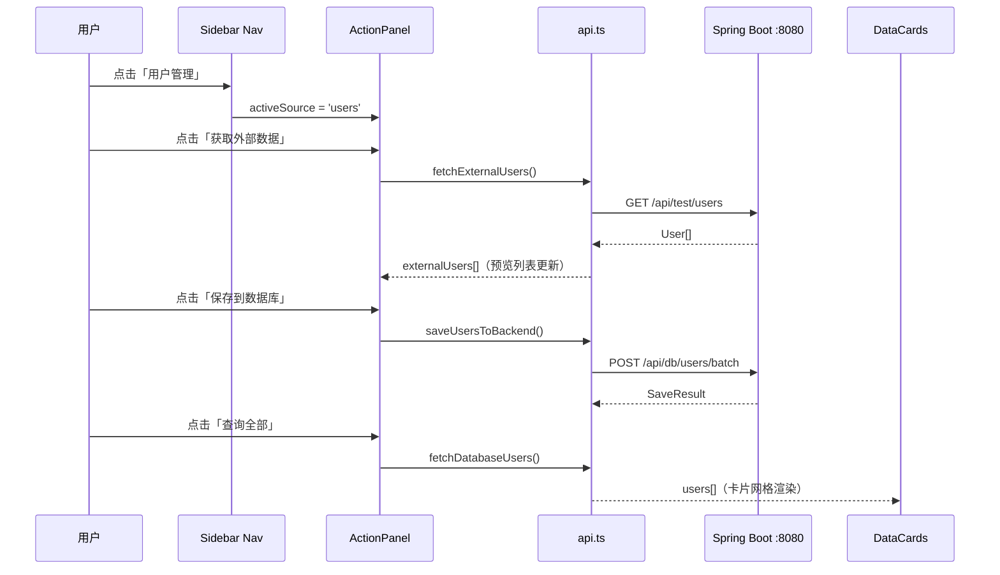
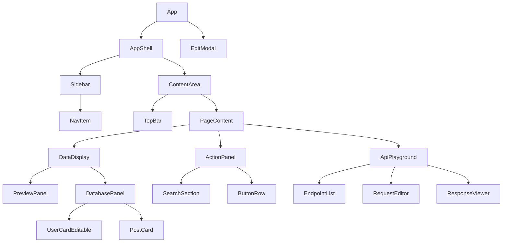

# Design Document: UI Redesign

## Overview

本次改造将 MCP 全栈数据流演示项目的前端 UI 从"学生作业风格"升级为"Developer Dashboard 专业风格"，对标 Postman / VS Code 的视觉语言。核心变化是将顶部 Header + Tabs 的扁平布局改为左侧固定导航栏 + 右侧内容区的 Sidebar Layout，同时建立完整的 CSS 变量设计系统，统一色彩、字体、间距和动效规范。

改造范围覆盖全局布局、设计系统（CSS 变量）、所有现有组件（Header、Nav、ActionPanel、DataCards、UserCard、PostCard、EditModal、ApiPlayground），以及新增骨架屏 loading 状态。改造过程中保持所有业务逻辑（App.tsx 中的状态管理和 API 调用）不变，仅修改视觉层。

---

## Part 1: High-Level Design（架构与视觉方案）

### 1.1 整体布局架构

从当前的"顶部 Header + 水平 Tabs + 居中内容区"改为"左侧 Sidebar + 右侧 Content Area"的经典 Dashboard 布局。



**布局尺寸规范：**
- Sidebar 宽度：240px（固定，不随内容滚动）
- Content Area：flex: 1，最大宽度 1200px（含 sidebar）
- 移动端（< 768px）：Sidebar 折叠为顶部汉堡菜单

### 1.2 页面级流程（数据流向）



### 1.3 组件树与职责划分



### 1.4 响应式断点策略

| 断点 | 宽度 | 布局变化 |
|------|------|----------|
| Desktop | ≥ 1024px | Sidebar 240px 固定展开 |
| Tablet | 768px–1023px | Sidebar 64px 图标模式（仅图标） |
| Mobile | < 768px | Sidebar 隐藏，顶部 TopBar 显示汉堡菜单，点击展开 overlay |

---

## Part 2: Design System（设计系统规范）

### 2.1 色彩系统

**主色板（CSS 变量）：**

```css
:root {
  /* === 主色 === */
  --color-primary: #2563EB;        /* 蓝色主色，用于查询按钮、链接、焦点环 */
  --color-primary-hover: #1D4ED8;
  --color-primary-light: #DBEAFE;  /* 主色浅色背景 */

  /* === 辅色 === */
  --color-accent: #7C3AED;         /* 紫色辅色，用于新增按钮、高亮标签 */
  --color-accent-hover: #6D28D9;
  --color-accent-light: #EDE9FE;

  /* === 语义色 === */
  --color-success: #16A34A;        /* 绿色，获取外部数据按钮 */
  --color-success-hover: #15803D;
  --color-success-light: #DCFCE7;
  --color-success-border: #86EFAC;

  --color-warning: #D97706;        /* 橙色，保存到数据库按钮 */
  --color-warning-hover: #B45309;
  --color-warning-light: #FEF3C7;
  --color-warning-border: #FCD34D;

  --color-danger: #DC2626;         /* 红色，删除操作 */
  --color-danger-hover: #B91C1C;
  --color-danger-light: #FEE2E2;
  --color-danger-border: #FCA5A5;

  /* === 中性色 === */
  --color-bg: #F8FAFC;             /* 页面背景 */
  --color-surface: #FFFFFF;        /* 卡片/面板背景 */
  --color-surface-hover: #F1F5F9;  /* 卡片 hover 背景 */
  --color-border: #E2E8F0;         /* 通用边框 */
  --color-border-strong: #CBD5E1;  /* 强调边框 */

  /* === 文字色 === */
  --color-text-primary: #0F172A;   /* 主要文字 */
  --color-text-secondary: #475569; /* 次要文字 */
  --color-text-muted: #94A3B8;     /* 占位符/禁用 */
  --color-text-inverse: #FFFFFF;   /* 深色背景上的文字 */

  /* === Sidebar 专用（深色） === */
  --sidebar-bg: #1E293B;
  --sidebar-border: #334155;
  --sidebar-text: #CBD5E1;
  --sidebar-text-active: #FFFFFF;
  --sidebar-item-hover: #334155;
  --sidebar-item-active: #2563EB;
  --sidebar-item-active-bg: rgba(37, 99, 235, 0.15);

  /* === 代码区专用（深色） === */
  --code-bg: #0F172A;
  --code-surface: #1E293B;
  --code-border: #334155;
  --code-text: #E2E8F0;
  --code-text-muted: #64748B;
  --code-green: #4ADE80;
  --code-blue: #60A5FA;
  --code-orange: #FB923C;
  --code-red: #F87171;
}
```

**按钮语义色映射：**

| 操作 | 颜色 | CSS 变量 | 说明 |
|------|------|----------|------|
| 获取外部数据 | 绿色 | `--color-success` | 表示"拉取/读取"操作 |
| 保存到数据库 | 橙色 | `--color-warning` | 表示"写入/持久化"操作 |
| 查询全部 | 蓝色 | `--color-primary` | 表示"查询/刷新"操作 |
| 新增 | 紫色 | `--color-accent` | 表示"创建"操作 |
| 删除 | 红色 | `--color-danger` | 表示"破坏性"操作 |
| 编辑 | 蓝色浅色 | `--color-primary-light` | 表示"修改"操作 |

### 2.2 字体系统

```css
:root {
  /* === 字体族 === */
  --font-sans: 'Inter', system-ui, -apple-system, sans-serif;
  --font-mono: 'JetBrains Mono', 'Fira Code', 'Cascadia Code', monospace;

  /* === 字号阶梯 === */
  --text-xs: 0.75rem;    /* 12px - 标签、徽章 */
  --text-sm: 0.875rem;   /* 14px - 辅助文字、表单标签 */
  --text-base: 1rem;     /* 16px - 正文 */
  --text-lg: 1.125rem;   /* 18px - 小标题 */
  --text-xl: 1.25rem;    /* 20px - 面板标题 */
  --text-2xl: 1.5rem;    /* 24px - 页面标题 */
  --text-3xl: 1.875rem;  /* 30px - 品牌名 */

  /* === 字重 === */
  --font-normal: 400;
  --font-medium: 500;
  --font-semibold: 600;
  --font-bold: 700;

  /* === 行高 === */
  --leading-tight: 1.25;
  --leading-normal: 1.5;
  --leading-relaxed: 1.625;
}
```

**字体使用规则：**
- `--font-sans`（Inter）：所有 UI 文字，包括标题、正文、按钮、表单
- `--font-mono`（JetBrains Mono）：ID 徽章（`#1`）、状态码（`HTTP 200`）、API URL、JSON 响应、代码区所有内容

### 2.3 间距系统

```css
:root {
  --space-1: 0.25rem;   /* 4px */
  --space-2: 0.5rem;    /* 8px */
  --space-3: 0.75rem;   /* 12px */
  --space-4: 1rem;      /* 16px */
  --space-5: 1.25rem;   /* 20px */
  --space-6: 1.5rem;    /* 24px */
  --space-8: 2rem;      /* 32px */
  --space-10: 2.5rem;   /* 40px */
  --space-12: 3rem;     /* 48px */
}
```

### 2.4 圆角与阴影

```css
:root {
  /* === 圆角 === */
  --radius-sm: 4px;
  --radius-md: 8px;
  --radius-lg: 12px;
  --radius-xl: 16px;
  --radius-full: 9999px;  /* 胶囊形 */

  /* === 阴影 === */
  --shadow-sm: 0 1px 2px rgba(0, 0, 0, 0.05);
  --shadow-md: 0 4px 6px rgba(0, 0, 0, 0.07), 0 1px 3px rgba(0, 0, 0, 0.06);
  --shadow-lg: 0 10px 15px rgba(0, 0, 0, 0.1), 0 4px 6px rgba(0, 0, 0, 0.05);
  --shadow-xl: 0 20px 25px rgba(0, 0, 0, 0.1), 0 8px 10px rgba(0, 0, 0, 0.04);
  --shadow-focus: 0 0 0 3px rgba(37, 99, 235, 0.25);  /* 焦点环 */
}
```

### 2.5 动效规范

```css
:root {
  /* === 过渡时长 === */
  --duration-fast: 100ms;    /* 按钮 hover 颜色变化 */
  --duration-normal: 200ms;  /* 卡片 hover、输入框焦点 */
  --duration-slow: 300ms;    /* 侧边栏展开/折叠、Modal 出现 */

  /* === 缓动函数 === */
  --ease-default: cubic-bezier(0.4, 0, 0.2, 1);  /* Material Design ease */
  --ease-in: cubic-bezier(0.4, 0, 1, 1);
  --ease-out: cubic-bezier(0, 0, 0.2, 1);
  --ease-spring: cubic-bezier(0.34, 1.56, 0.64, 1);  /* 弹性效果，用于卡片 hover */
}
```

**动效使用规则：**

| 元素 | 触发 | 效果 | 时长 |
|------|------|------|------|
| 按钮 | hover | `background-color` 变深 | `--duration-fast` |
| 按钮 | active | `transform: scale(0.97)` | `--duration-fast` |
| 卡片 | hover | `box-shadow` 增强 + `transform: translateY(-2px)` | `--duration-normal` + `--ease-spring` |
| 输入框 | focus | `border-color` → primary + `box-shadow` 焦点环 | `--duration-normal` |
| Sidebar Nav Item | hover | `background` → `--sidebar-item-hover` | `--duration-fast` |
| Modal | 出现 | `opacity: 0→1` + `transform: scale(0.95→1)` | `--duration-slow` + `--ease-out` |
| 骨架屏 | 持续 | `background` shimmer 动画 | 1.5s 循环 |

---

## Part 3: Components and Interfaces（组件改造方案）

### 3.1 AppShell（全局布局容器）

**当前：** `.app` 使用 `flex-direction: column`，顶部 header + 居中 main（max-width: 900px）

**改造后：**

```
.app-shell
├── .sidebar（240px 固定宽，深色，position: sticky top: 0，height: 100vh）
└── .content-area（flex: 1，overflow-y: auto）
    ├── .topbar（sticky，白色，显示当前页面标题 + loading 指示器）
    └── .page-content（padding: var(--space-6)，max-width: 1200px）
```

**接口（CSS 类）：**
```typescript
// App.tsx 中 JSX 结构变化
<div className="app-shell">
  <Sidebar activeSource={activeSource} onNavigate={setActiveSource} />
  <div className="content-area">
    <TopBar title={pageTitle} loading={isLoading} />
    <main className="page-content">
      {/* 页面内容 */}
    </main>
  </div>
</div>
```

### 3.2 Sidebar（左侧导航栏）

**当前：** 不存在，由 `.source-tabs` 水平 tab 替代

**改造后：** 新建 `Sidebar.tsx` 组件

**视觉规范：**
- 背景：`--sidebar-bg`（#1E293B 深蓝灰）
- 宽度：240px，`height: 100vh`，`position: sticky; top: 0`
- 顶部 Logo 区：品牌名 "MCP Demo" + 副标题 "全栈数据流"，使用 `--font-mono`
- Nav Items：图标（SVG）+ 文字标签，active 状态左侧蓝色竖条 + 背景高亮
- 底部：后端地址信息（`--sidebar-text-muted`）

**Nav Item 状态：**
```
默认：color: --sidebar-text，background: transparent
Hover：background: --sidebar-item-hover
Active：background: --sidebar-item-active-bg，color: --sidebar-text-active，左侧 3px 蓝色 border
```

**SVG 图标方案（替代 emoji）：**
| 模块 | 当前 emoji | 替换 SVG 图标 |
|------|-----------|--------------|
| 用户管理 | 👥 | `users` 图标（两个人形轮廓） |
| 帖子管理 | 📝 | `file-text` 图标（文档+线条） |
| API 练习场 | 🧪 | `terminal` 图标（命令行符号） |

**接口：**
```typescript
interface SidebarProps {
  activeSource: DataSource | 'playground';
  onNavigate: (source: DataSource | 'playground') => void;
}
```

### 3.3 TopBar（顶部状态栏）

**当前：** 不存在（header 是全宽渐变横幅）

**改造后：** 新建 `TopBar.tsx`，位于 content-area 顶部

**视觉规范：**
- 背景：`--color-surface`（白色），底部 1px `--color-border`
- 高度：56px，`position: sticky; top: 0; z-index: 10`
- 左侧：当前页面标题（`--text-xl`，`--font-semibold`）
- 右侧：loading spinner（仅在 `loading=true` 时显示）+ 错误提示 badge

**接口：**
```typescript
interface TopBarProps {
  title: string;
  loading: boolean;
  error?: string | null;
}
```

### 3.4 ActionPanel（操作面板）

**当前：** `.action-panel` 白色卡片，panel-header 使用紫色渐变，内含按钮行 + 搜索区

**改造后：** 保持卡片结构，更新视觉

**Panel Header 改造：**
- 移除紫色渐变背景
- 改为白色背景 + 底部 `--color-border` 分割线
- 标题使用 `--color-text-primary`，`--font-semibold`
- 图标改为对应 SVG（不用 emoji）

**按钮行改造（语义化配色）：**
```css
/* 获取外部数据 - 绿色 */
.btn-fetch {
  background: var(--color-success);
  color: var(--color-text-inverse);
}
.btn-fetch:hover { background: var(--color-success-hover); }

/* 保存到数据库 - 橙色 */
.btn-save {
  background: var(--color-warning);
  color: var(--color-text-inverse);
}

/* 查询全部 - 蓝色 */
.btn-query {
  background: var(--color-primary);
  color: var(--color-text-inverse);
}

/* 新增 - 紫色 */
.btn-add {
  background: var(--color-accent);
  color: var(--color-text-inverse);
}
```

**搜索区改造：**
- 输入框：`border: 1px solid --color-border`，focus 时 `border-color: --color-primary` + 焦点环
- 搜索按钮：`--color-primary` 蓝色
- 城市筛选 select：统一样式，自定义下拉箭头

### 3.5 DataDisplay（数据展示区）

**当前：** 两列 grid（外部数据 + 数据库数据），panel-header 紫色渐变

**改造后：**
- 保持两列 grid 布局
- Panel Header 改为白色 + 左侧彩色竖条区分（外部数据=橙色，数据库数据=蓝色）
- 数据计数徽章：`--font-mono`，`--color-primary-light` 背景

**PreviewPanel（外部数据预览）：**
- 预览条目：`--color-surface-hover` 背景，hover 时 `--color-border-strong` 边框
- ID 徽章：`--font-mono`，`--color-warning-light` 背景，`--color-warning` 文字

**DatabasePanel（数据库数据）：**
- 卡片网格：`gap: --space-4`
- 空状态：SVG 插图 + 引导文字（替代纯文字 empty-state）

### 3.6 UserCardEditable（用户卡片）

**当前：** 浅灰背景，emoji 图标，hover 时紫色边框

**改造后：**

```
.user-card
├── .user-card-header（flex，align-items: center）
│   ├── .user-avatar-placeholder（32px 圆形，用户名首字母，--color-primary-light 背景）
│   ├── .user-name（--font-semibold，--color-text-primary）
│   ├── .user-id-badge（--font-mono，--text-xs，--color-accent-light 背景）
│   └── .card-actions（ml-auto，flex gap-1）
│       ├── .btn-icon-edit（蓝色浅色背景，SVG 铅笔图标）
│       └── .btn-icon-delete（红色浅色背景，SVG 垃圾桶图标）
└── .user-card-body（grid 2列，gap: --space-2）
    ├── .info-item（SVG 图标 + 文字，替代 emoji）
    └── ...
```

**卡片动效：**
```css
.user-card {
  transition: transform var(--duration-normal) var(--ease-spring),
              box-shadow var(--duration-normal) var(--ease-default);
}
.user-card:hover {
  transform: translateY(-2px);
  box-shadow: var(--shadow-lg);
}
```

**SVG 图标替换：**
| 当前 emoji | 替换 SVG | 含义 |
|-----------|---------|------|
| 👤 | `user` icon | 用户名 |
| 📧 | `mail` icon | 邮箱 |
| 📍 | `map-pin` icon | 城市 |
| 🏢 | `building` icon | 公司 |
| ✏️ | `pencil` icon | 编辑 |
| 🗑️ | `trash` icon | 删除 |

### 3.7 PostCard（帖子卡片）

**当前：** 与 UserCard 类似，浅灰背景，emoji 图标

**改造后：**

```
.post-card
├── .post-card-header
│   ├── .post-id-badge（--font-mono，--color-primary-light 背景）
│   ├── .post-user-badge（"用户 #N"，--color-accent-light 背景）
│   └── .card-actions
├── .post-title（--font-semibold，--color-text-primary，line-clamp: 2）
└── .post-body（--color-text-secondary，line-clamp: 3，--text-sm）
```

**状态色彩区分（可选增强）：**
- 帖子卡片左侧 3px 竖条，颜色根据 `userId % 5` 映射到 5 种主题色，增加视觉区分度

### 3.8 EditModal（编辑弹窗）

**当前：** 白色弹窗，紫色保存按钮，无动效

**改造后：**

**动效：**
```css
.modal-overlay {
  animation: fadeIn var(--duration-slow) var(--ease-out);
}
.modal-content {
  animation: scaleIn var(--duration-slow) var(--ease-out);
}
@keyframes fadeIn { from { opacity: 0; } to { opacity: 1; } }
@keyframes scaleIn { from { opacity: 0; transform: scale(0.95); } to { opacity: 1; transform: scale(1); } }
```

**表单改造：**
- 标签：`--text-sm`，`--font-medium`，`--color-text-secondary`
- 输入框：统一 `border: 1px solid --color-border`，focus 焦点环
- 保存按钮：`--color-primary`（蓝色，表示"确认"操作）
- 取消按钮：`--color-surface`，`border: 1px solid --color-border`

**Modal Header：**
- 移除 emoji，改为 SVG 图标 + 标题
- 关闭按钮：`×` 改为 SVG `x` 图标，hover 时 `--color-danger-light` 背景

### 3.9 ApiPlayground（API 练习场）

**当前：** 全 inline style，深色主题，与整体割裂

**改造后：** 移除所有 inline style，改用 CSS 类，使用 CSS 变量统一深色代码区风格

**布局保持不变**（左侧端点列表 + 右侧编辑器），但视觉融入主题：

**端点列表区：**
```css
.playground-sidebar {
  background: var(--code-surface);
  border-right: 1px solid var(--code-border);
  width: 260px;
}
.endpoint-category-label {
  font-family: var(--font-sans);
  color: var(--code-text-muted);
  font-size: var(--text-xs);
  text-transform: uppercase;
  letter-spacing: 0.05em;
}
.endpoint-btn {
  font-family: var(--font-mono);
  font-size: var(--text-xs);
  background: transparent;
  color: var(--code-text);
  border: 1px solid var(--code-border);
}
.endpoint-btn:hover { background: var(--sidebar-item-hover); }
.endpoint-btn.active { background: rgba(37, 99, 235, 0.2); border-color: var(--color-primary); }
```

**HTTP Method 颜色（与当前保持一致，改用变量）：**
```css
.method-get    { color: var(--code-green); }
.method-post   { color: var(--code-blue); }
.method-put    { color: var(--code-orange); }
.method-delete { color: var(--code-red); }
```

**请求编辑器区：**
```css
.request-editor {
  background: var(--code-bg);
  color: var(--code-text);
}
.url-input-field {
  background: var(--code-surface);
  border: 1px solid var(--code-border);
  color: var(--code-text);
  font-family: var(--font-mono);
}
.send-btn {
  background: var(--color-primary);  /* 统一蓝色发送按钮 */
}
```

**响应区：**
```css
.response-panel {
  background: var(--code-bg);
  border: 1px solid var(--code-border);
  font-family: var(--font-mono);
  color: var(--code-text);
}
.status-badge-success { color: var(--code-green); }
.status-badge-error   { color: var(--code-red); }
```

**整体容器：**
```css
.api-playground {
  background: var(--code-bg);
  border-radius: var(--radius-lg);
  overflow: hidden;
  /* 与主内容区通过圆角和阴影区分，但不再割裂 */
  box-shadow: var(--shadow-lg);
}
```

---

## Part 4: Low-Level Design（实现细节）

### 4.1 文件结构变化

```
fetch-mcp-demo/src/
├── App.tsx                          # 修改：JSX 结构改为 app-shell 布局
├── App.css                          # 重写：全部改用 CSS 变量，约 800 行
├── index.css                        # 修改：引入 Inter + JetBrains Mono 字体
├── components/
│   ├── Sidebar.tsx                  # 新建：左侧导航栏
│   ├── TopBar.tsx                   # 新建：顶部状态栏
│   ├── SkeletonCard.tsx             # 新建：骨架屏组件
│   ├── ApiPlayground.tsx            # 修改：移除 inline style，改用 CSS 类
│   ├── UserCardEditable.tsx         # 修改：SVG 图标，新 CSS 类
│   ├── PostCard.tsx                 # 修改：SVG 图标，新 CSS 类
│   ├── EditModal.tsx                # 修改：动效，新 CSS 类
│   └── DataPanel.tsx                # 修改（如使用）：新 CSS 类
└── assets/
    └── icons.tsx                    # 新建：SVG 图标组件集合
```

### 4.2 CSS 变量体系完整结构

App.css 顶部 `:root` 块包含所有变量（见 2.1–2.5 节），后续所有样式规则均通过 `var()` 引用，禁止硬编码颜色值。

**变量命名规范：**
- `--color-*`：颜色
- `--font-*`：字体族
- `--text-*`：字号
- `--font-*`（weight）：字重（与字体族共用前缀，通过语义区分）
- `--space-*`：间距
- `--radius-*`：圆角
- `--shadow-*`：阴影
- `--duration-*`：动效时长
- `--ease-*`：缓动函数
- `--sidebar-*`：Sidebar 专用
- `--code-*`：代码区专用

### 4.3 骨架屏（SkeletonCard）实现规范

**触发条件：** `loading === true` 且对应数据数组为空时，显示骨架屏替代空状态

**骨架屏动画：**
```css
@keyframes skeleton-shimmer {
  0%   { background-position: -200% 0; }
  100% { background-position: 200% 0; }
}

.skeleton {
  background: linear-gradient(
    90deg,
    var(--color-border) 25%,
    var(--color-surface-hover) 50%,
    var(--color-border) 75%
  );
  background-size: 200% 100%;
  animation: skeleton-shimmer 1.5s infinite;
  border-radius: var(--radius-sm);
}
```

**UserCard 骨架屏结构：**
```
.skeleton-card（模拟 user-card 尺寸）
├── .skeleton-header（flex，gap）
│   ├── .skeleton-avatar（32px 圆形）
│   ├── .skeleton-name（120px × 16px）
│   └── .skeleton-badge（48px × 16px）
└── .skeleton-body
    ├── .skeleton-line（100% × 12px）
    ├── .skeleton-line（80% × 12px）
    └── .skeleton-line（60% × 12px）
```

**数量：** 默认渲染 3 个骨架卡片（`Array(3).fill(null).map((_, i) => <SkeletonCard key={i} />)`）

### 4.4 SVG 图标组件（icons.tsx）

所有图标统一封装为 React 组件，接受 `size`（默认 16）和 `className` props：

```typescript
interface IconProps {
  size?: number;
  className?: string;
}

export const IconUsers = ({ size = 16, className }: IconProps) => (
  <svg width={size} height={size} viewBox="0 0 24 24" fill="none"
       stroke="currentColor" strokeWidth={2} className={className}>
    {/* SVG path for users icon */}
  </svg>
);

// 同理：IconFileText, IconTerminal, IconUser, IconMail,
//       IconMapPin, IconBuilding, IconPencil, IconTrash,
//       IconX, IconSearch, IconPlus, IconDatabase,
//       IconDownload, IconSave, IconRefreshCw
```

**图标尺寸规范：**
- Sidebar Nav：20px
- 按钮内图标：16px
- 卡片内信息图标：14px
- TopBar：18px

### 4.5 App.tsx JSX 结构改造

**改造前（简化）：**
```tsx
<div className="app">
  <header className="header">...</header>
  <main className="main">
    <div className="source-tabs">...</div>
    <div className="action-panel">...</div>
    <div className="data-display">...</div>
  </main>
  <footer className="footer">...</footer>
</div>
```

**改造后：**
```tsx
<div className="app-shell">
  <Sidebar activeSource={activeSource} onNavigate={setActiveSource} />
  <div className="content-area">
    <TopBar
      title={PAGE_TITLES[activeSource]}
      loading={isLoading}
      error={error}
    />
    <main className="page-content">
      {error && <div className="alert alert-error">...</div>}

      {activeSource === 'playground' && <ApiPlayground />}

      {activeSource !== 'playground' && (
        <>
          <ActionPanel
            source={activeSource}
            loading={isLoading}
            /* ...所有 handler props */
          />
          <div className="data-display">
            <PreviewPanel source={activeSource} data={...} />
            <DatabasePanel source={activeSource} data={...} loading={isLoading} />
          </div>
        </>
      )}
    </main>
  </div>

  {editModal.show && <EditModal ... />}
</div>
```

**PAGE_TITLES 映射：**
```typescript
const PAGE_TITLES: Record<DataSource | 'playground', string> = {
  users: '用户管理',
  posts: '帖子管理',
  playground: 'API 练习场',
};
```

### 4.6 响应式实现细节

**移动端 Sidebar 折叠：**
```css
@media (max-width: 767px) {
  .app-shell {
    flex-direction: column;
  }
  .sidebar {
    position: fixed;
    left: -240px;
    top: 0;
    height: 100vh;
    z-index: 100;
    transition: left var(--duration-slow) var(--ease-out);
  }
  .sidebar.open {
    left: 0;
  }
  .sidebar-overlay {
    display: block;
    position: fixed;
    inset: 0;
    background: rgba(0, 0, 0, 0.5);
    z-index: 99;
  }
  .content-area {
    width: 100%;
  }
  .topbar {
    /* 显示汉堡菜单按钮 */
  }
  .hamburger-btn {
    display: flex;
  }
}

@media (min-width: 768px) {
  .hamburger-btn { display: none; }
  .sidebar-overlay { display: none; }
}
```

**Tablet 图标模式（768px–1023px）：**
```css
@media (min-width: 768px) and (max-width: 1023px) {
  .sidebar {
    width: 64px;
  }
  .sidebar .nav-label,
  .sidebar .brand-subtitle,
  .sidebar .sidebar-footer-text {
    display: none;
  }
  .sidebar .nav-item {
    justify-content: center;
    padding: var(--space-3);
  }
}
```

### 4.7 字体加载（index.css）

```css
/* Google Fonts 引入 */
@import url('https://fonts.googleapis.com/css2?family=Inter:wght@400;500;600;700&family=JetBrains+Mono:wght@400;500&display=swap');

/* 全局重置 */
*, *::before, *::after {
  box-sizing: border-box;
  margin: 0;
  padding: 0;
}

body {
  font-family: var(--font-sans);
  background: var(--color-bg);
  color: var(--color-text-primary);
  line-height: var(--leading-normal);
  -webkit-font-smoothing: antialiased;
}
```

### 4.8 错误与状态反馈改造

**当前：** `.error-message` 红色背景横幅，`.save-result` 绿/红背景块

**改造后：** 统一 Alert 组件样式

```css
.alert {
  display: flex;
  align-items: flex-start;
  gap: var(--space-3);
  padding: var(--space-3) var(--space-4);
  border-radius: var(--radius-md);
  border: 1px solid;
  font-size: var(--text-sm);
  margin-bottom: var(--space-4);
}
.alert-error {
  background: var(--color-danger-light);
  border-color: var(--color-danger-border);
  color: var(--color-danger);
}
.alert-success {
  background: var(--color-success-light);
  border-color: var(--color-success-border);
  color: var(--color-success);
}
```

**TopBar 中的 loading 指示器：**
```css
.topbar-spinner {
  width: 18px;
  height: 18px;
  border: 2px solid var(--color-border);
  border-top-color: var(--color-primary);
  border-radius: 50%;
  animation: spin 0.8s linear infinite;
}
```

---

## Part 5: Correctness Properties（正确性约束）

*A property is a characteristic or behavior that should hold true across all valid executions of a system — essentially, a formal statement about what the system should do.*

### Property 1: 响应式布局断点一致性

*For any* 视口宽度，Sidebar 的可见性和宽度必须符合断点规范：≥ 1024px 时宽度为 240px 且可见，768px–1023px 时宽度为 64px 且可见，< 768px 时完全隐藏（不占用页面空间）

**Validates: Requirements 1.2, 1.3, 1.4**

### Property 2: 导航状态与页面标题一致性

*For any* `activeSource` 值（`'users'`、`'posts'`、`'playground'`），Sidebar 中对应 Nav_Item 的 active 状态和 TopBar 显示的页面标题必须同时与该值保持一致

**Validates: Requirements 3.3, 3.4, 4.2**

### Property 3: 按钮语义色映射正确性

*For any* ActionPanel 中的操作按钮，其背景色 CSS 变量引用必须与操作语义对应：获取外部数据 → `--color-success`，保存到数据库 → `--color-warning`，查询全部 → `--color-primary`，新增 → `--color-accent`，删除 → `--color-danger`

**Validates: Requirements 2.2, 5.2**

### Property 4: 禁用按钮状态不变性

*For any* 处于 `disabled` 状态的按钮，其 `opacity` 必须为 0.5，`cursor` 必须为 `not-allowed`，且 hover 事件不得改变其视觉样式

**Validates: Requirements 5.3**

### Property 5: 交互元素焦点环可见性

*For any* 可交互元素（按钮、输入框、select、链接），当其获得键盘焦点时，必须显示基于 `--shadow-focus` 的可见焦点环

**Validates: Requirements 5.6, 7.8, 11.1**

### Property 6: 卡片 hover 动效隔离性

*For any* 卡片网格中的 UserCard 或 PostCard，当某张卡片触发 hover 动效时，相邻卡片的位置（`getBoundingClientRect()`）不得发生变化

**Validates: Requirements 6.4, 6.7, 6.8**

### Property 7: 骨架屏显示条件正确性

*For any* `loading` 和 `data` 的组合状态，DataDisplay 的渲染结果必须满足：仅当 `loading === true` 且 `data.length === 0` 时显示 SkeletonCard，其他所有情况显示真实数据卡片

**Validates: Requirements 8.1, 8.2, 8.5**

### Property 8: 图标按钮无障碍标签完整性

*For any* 仅包含 Icon_Component 的按钮元素（无可见文字标签），其 DOM 元素必须包含非空的 `aria-label` 属性

**Validates: Requirements 11.2**

### Property 9: Content Area 无水平溢出

*For any* 视口宽度（≥ 320px），Content_Area 的 `scrollWidth` 不得超过其 `clientWidth`，即不产生水平滚动条

**Validates: Requirements 1.2, 1.8**

---

### 5.1 设计系统约束（实现指南）

- 所有颜色值必须通过 CSS 变量引用，禁止在组件样式中硬编码十六进制颜色
- 所有间距必须使用 `--space-*` 变量，禁止使用 `px` 魔法数字（字体大小、border-width 除外）
- 所有动效时长必须使用 `--duration-*` 变量

### 5.2 布局约束（实现指南）

- Sidebar 宽度固定 240px，不受内容影响
- Content Area 在任何视口宽度下不得出现水平滚动条
- 页面内容区最大宽度 1200px（含 sidebar），内容区实际最大宽度约 960px
- 移动端（< 768px）时，Sidebar 必须完全隐藏，不占用页面空间

### 5.3 组件行为约束（实现指南）

- 所有按钮在 `disabled` 状态下 `opacity: 0.5`，`cursor: not-allowed`，且不触发 hover 效果
- 所有输入框 focus 时必须显示焦点环（`--shadow-focus`），满足可访问性要求
- 卡片 hover 动效不得影响相邻卡片的位置（使用 `transform` 而非 `margin/padding`）
- Modal 出现时必须有背景遮罩，点击遮罩关闭 Modal
- 骨架屏仅在 `loading === true` 且数据为空时显示，数据加载完成后立即替换为真实内容

### 5.4 可访问性约束（实现指南）

- 所有交互元素（按钮、链接、输入框）必须有可见的 focus 状态
- 图标按钮必须有 `aria-label` 属性（如 `aria-label="编辑用户"`）
- 颜色对比度：正文文字与背景对比度 ≥ 4.5:1（WCAG AA）
- Sidebar Nav Item 的 active 状态不能仅靠颜色区分，必须有其他视觉指示（左侧竖条）

### 5.5 业务逻辑不变性约束（实现指南）

- 改造过程中，App.tsx 中所有状态变量和事件处理函数保持不变
- 所有 API 调用路径（`services/api.ts`）不受 UI 改造影响
- 组件 props 接口（`UserCardEditable`、`PostCard`、`EditModal`）保持向后兼容

---

## Part 6: Error Handling（错误处理）

### 6.1 字体加载失败

**条件：** Google Fonts 无法访问（网络限制）
**处理：** `font-family` 声明包含完整 fallback 链：`'Inter', system-ui, -apple-system, sans-serif`，降级到系统字体，UI 功能不受影响

### 6.2 SVG 图标渲染失败

**条件：** `icons.tsx` 中某个图标组件报错
**处理：** 每个图标组件用 `try-catch` 或 ErrorBoundary 包裹，降级显示文字标签

### 6.3 响应式布局边界

**条件：** 极窄视口（< 320px）
**处理：** 设置 `min-width: 320px` 在 `body`，防止布局崩溃

---

## Part 7: Dependencies（依赖）

### 新增依赖

无需新增 npm 包。所有改造基于：
- React（已有）
- TypeScript（已有）
- 纯 CSS（无 Tailwind，保持现有技术栈）
- Google Fonts（CDN 引入，无需安装）
- SVG 图标内联（无需图标库，手写 SVG path）

### 字体资源

```
Inter: https://fonts.google.com/specimen/Inter
JetBrains Mono: https://fonts.google.com/specimen/JetBrains+Mono
```

如需离线支持，可将字体文件下载到 `public/fonts/` 并使用 `@font-face` 本地引入。
